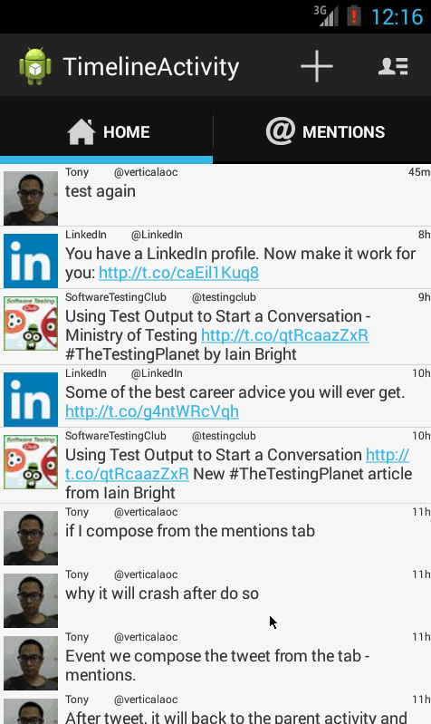

# Grid Image Search

Time spent: 8 hours spent in total

  * [x] Includes all required user stories from Week 3 Twitter Client
  * [x] User can switch between Timeline and Mention views using tabs.
    * [x] User can view their home timeline tweets.
    * [x] User can view the recent mentions of their username.
    * [x] User can scroll to bottom of either of these lists and new tweets will load ("infinite scroll")
    * [ ] Optional: Implement this in a gingerbread-compatible approach
  * [x] User can navigate to view their own profile
    * [x] User can see picture, tagline, # of followers, # of following, and tweets on their profile.
  * [ ] User can click on the profile image in any tweet to see another user's profile.
    * [ ] User can see picture, tagline, # of followers, # of following, and tweets of clicked user.
    * [ ] Profile view should include that user's timeline
    * [ ] Optional: User can view following / followers list through the profile
  * [ ] Optional: When a network request goes out, user sees an indeterminate progress indicator
  * [ ] Optional: User can "reply" to any tweet on their home timeline
    * [ ] The user that wrote the original tweet is automatically "@" replied in compose
  * [ ] Optional: User can click on a tweet to be taken to a "detail view" of that tweet
    * [ ] Optional: User can take favorite (and unfavorite) or reweet actions on a tweet
  * [ ] Optional: Improve the user interface and theme the app to feel twitter branded
  * [ ] Optional: User can search for tweets matching a particular query and see results
  * [ ] Stretch: User can view their direct messages (or send new ones)

Walkthrough of all user stories:

GIF created with [LiceCap](http://www.cockos.com/licecap/).
 
  
